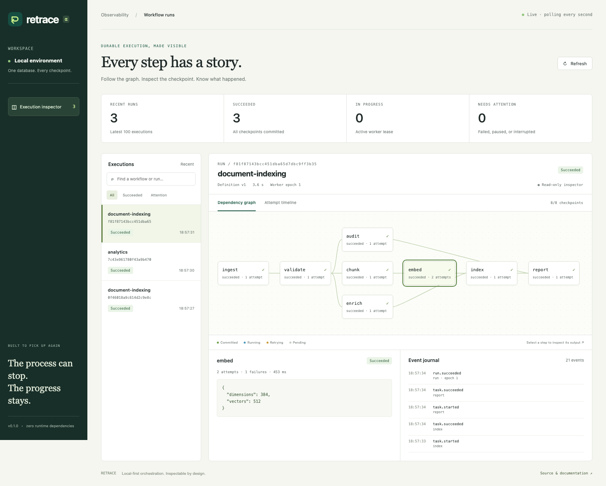

<p align="center"></p>
<h1 align="center">Retrace</h1>
<p align="center"><strong>The process can stop. The progress stays.</strong><br>Crash-resumable Python workflows. One SQLite file. No services.</p>
<p align="center">
  <a href="https://github.com/Sanjays2402/retrace/actions/workflows/ci.yml"></a>
  
  
  <a href="LICENSE"></a>
</p>

Retrace is an embedded workflow engine for async Python. It checkpoints successful steps,
retries transient failures, and resumes interrupted dependency graphs. Use it for local data
pipelines, document ingestion, batch API jobs, and multi-step tools that should survive a
process restart.

**Early alpha.** The failure semantics are explicit and tested; the API may change before 1.0.



**Try it now:** [Interactive recovery demo](https://sanjays2402.github.io/retrace/) — no install or account.

**New here?** [Five-minute recovery walkthrough](docs/getting-started.md) ·
[Real CSV and HTTP examples](docs/examples.md) · [Is Retrace a fit?](docs/choosing-retrace.md)

## Try it in a minute

Requires **Python 3.11+**. Install from the repository; this project is not yet published to PyPI.

```bash
git clone https://github.com/Sanjays2402/retrace.git
cd retrace
python3 -m venv .venv
source .venv/bin/activate              # Windows: .venv\Scripts\activate
python -m pip install -e .
retrace demo
retrace serve
```

Open **http://127.0.0.1:7760**. In another terminal, run `retrace demo` again to watch the graph
update. The eight-step document-indexing simulation deliberately fails its first embedding
attempt, then retries and commits 512 simulated vectors. It makes no external API calls.

## The interesting part: kill it

```bash
retrace --lease-ttl 1.5 demo --crash
# Deliberately exits with code 86 during embedding. Copy the printed run ID.
# Wait two seconds for the dead worker's lease to expire, then:
retrace resume retrace.demo:workflow <RUN_ID>
retrace inspect <RUN_ID>
```

`ingest`, `validate`, `chunk`, and other completed steps are reused. The interrupted embedding
attempt stays visible in the timeline; a new worker completes the run. The integration suite
also kills a real child process without cleanup, resumes it in a different process, verifies
that a completed step ran once, and checks SQLite integrity.

## Recover a failed branch

Fix the external cause of a failure, then preview and retry only the affected work:

```bash
retrace retry pipeline:workflow <RUN_ID> --task publish --dry-run
retrace retry pipeline:workflow <RUN_ID> --task publish
```

Omit `--task` to retry all failed steps, or repeat it to select several. Successful steps stay
committed; eligible blocked descendants are reopened. Shared downstream steps remain blocked
while any dependency is still failed. Attempt numbers, idempotency keys, and history are preserved.
See [the recovery guide](docs/recovery.md) for a runnable example and the exact failure-budget rules.

## A workflow is ordinary Python

```python
# pipeline.py
from retrace import Context, Task, Workflow


async def extract(ctx: Context):
    return ctx.input["values"]


async def summarize(ctx: Context):
    values = ctx.dependencies["extract"]
    return {"total": sum(values), "count": len(values)}


workflow = Workflow(
    "analytics",
    (
        Task("extract", extract),
        Task("summarize", summarize, needs=("extract",)),
    ),
    version="1",
)
```

```bash
retrace run pipeline:workflow --input '{"values": [3, 7, 11]}'
retrace runs                    # latest 100 runs, newest first
retrace runs --limit 5          # restrict the listing
retrace events <RUN_ID> > events.jsonl
```

Or embed it directly:

```python
import asyncio
from retrace import Engine, Store
from pipeline import workflow


async def main():
    with Store("retrace.db") as store:
        result = await Engine(store, concurrency=4).run(workflow, {"values": [3, 7, 11]})
        print(result.outputs["summarize"])  # {"count": 3, "total": 21}
        # After a restart: await Engine(store).resume(workflow, saved_run_id)


asyncio.run(main())
```

## What is built in

| Capability | Implementation |
| --- | --- |
| Durable checkpoints | SQLite WAL, `synchronous=FULL`; state and event commit together |
| Crash recovery | Expired run leases are reclaimed; successful steps are reused |
| Stale-worker protection | Every write checks owner, monotonically increasing epoch, and lease expiry |
| Dependency-aware scheduling | Validated DAG, bounded async concurrency, failed descendants blocked |
| Selective recovery | Retry chosen failed branches with a dry-run plan; preserve checkpoints and audit history |
| Durable retries | Exponential backoff with a cap; failure counts and retry deadlines survive restarts |
| Timeouts and cancellation | Cooperative task deadlines; graceful interruption pauses the run |
| Inspectable execution | Step outputs, complete attempt history, cursor-based JSONL event export |
| Local dashboard | Live polling, graph, attempt timeline, journal filters, payload search, and JSONL download |
| Explicit compatibility | Workflow manifests are fingerprinted; changed definitions cannot reuse checkpoints |
| Small operational footprint | Python standard library at runtime; no broker, container, or server cluster |

## Guarantees and boundaries

- **Task execution is at least once.** A crash can happen after an external API accepts a request
  and before its result is committed. Use `ctx.idempotency_key` with downstream systems that
  support deduplication. Worker fencing protects Retrace's database, not external side effects.
- **One worker owns a run; its ready tasks execute concurrently.** Different runs may use
  different worker processes against the same local SQLite file. There is no distributed
  task queue or automatic worker daemon.
- **Completed outputs are immutable checkpoints.** Retrace resumes from them; it does not
  replay successful functions. After fixing an external failure, explicitly retry failed steps
  with `retrace retry`. Use `--dry-run` to preview the affected steps; `resume` never resets failures.
- **Bump `Workflow.version` when implementation behavior changes.** The fingerprint covers
  graph structure, function identity, retry policy, and timeouts, not function source or dependencies.
- **Tasks must cooperate with asyncio.** Blocking CPU work delays heartbeats. Timeouts and
  cancellation cannot forcibly terminate code that suppresses cancellation.
- **Small JSON values, local disk.** Each input/output is limited to 1 MiB. Store large artifacts
  separately. Network filesystems, distributed clocks, encrypted storage, and multi-tenant
  hosting are outside the supported scope.
- **The inspector is local and read-only.** It binds to loopback, rejects foreign Host/Origin
  headers, and serves no mutation routes. It displays stored inputs, errors, and outputs; avoid
  persisting secrets. Its graph is designed for small to medium workflows.

See [architecture and failure semantics](docs/architecture.md), [the API guide](docs/api.md),
and [security guidance](SECURITY.md).

## Interactive recovery lab

The [live browser playground](https://sanjays2402.github.io/retrace/) demonstrates a crash and recovery with step playback,
checkpoint inspection, attempt history, journal filtering, and sample JSON exports.
It runs entirely in the browser with synthetic data; the real Python engine runs locally.
[Explore the playground source and development guide](playground).

## Development

```bash
python -m pip install -e '.[dev]'
ruff check .
ruff format --check .
python -m coverage run -m unittest discover -s tests -v
python -m coverage report --fail-under=95
python -m build
python scripts/smoke_wheel.py
```

The Python suite includes **53 tests**, 25 reproducible generated DAGs, transactional rollback
injection, live-lease exclusion, stale-worker fencing, persistent retry deadlines, CLI behavior,
HTTP security checks, and a real process-kill/restart test. Initial local verification on Python
3.12 reports **97% combined statement/branch coverage** and **100% for the scheduler**.
CI enforces 95% overall and tests Python 3.11–3.14 on Linux, plus Python 3.12 on macOS and Windows.
Fourteen Playwright browser tests cover real inspector interactions and failure states.
The packaging job installs the built wheel into a clean environment outside the source tree.

A [reproducible local benchmark](docs/benchmark.md) records scheduler/checkpoint overhead and its limits.

## Contribute

Start with [CONTRIBUTING.md](CONTRIBUTING.md). The most useful contributions make execution
semantics easier to verify, improve operational visibility, or remove a concrete limitation.
[The roadmap](docs/roadmap.md) includes scoped starter tasks and design work. Bug reports should
include a minimal workflow and the relevant journal events with sensitive data removed.

MIT licensed. Built by [Sanjay Santhanam](https://github.com/Sanjays2402).

### Performance trace export and graph navigation

Use **Download trace** in the inspector to save the selected run, or export every recorded attempt from the CLI, including failures and recovery history:

```sh
retrace --db retrace.db trace RUN_ID > run.trace.json
```

Open the JSON in [Perfetto](https://ui.perfetto.dev) using **Open trace file**.
The exporter uses the [Chrome JSON trace format](https://perfetto.dev/docs/getting-started/other-formats),
with one lane per task and microsecond timestamps relative to run creation.
Unfinished attempts appear as instant events because their end time is unknown.
Inputs, outputs, and exception messages are excluded; workflow and task names remain.
Export uses a consistent read-only snapshot and never imports workflow code.

The local inspector now includes **Zoom in**, **Zoom out**, **Fit graph**, and
**Reset zoom**. Fit follows viewport changes, and live polling preserves your zoom.

Inspector URLs now preserve the selected run, step, and execution view. Use **Permalink**
to copy a link, bookmark an investigation, or navigate with browser Back and Forward.
Links refer to the database served by that inspector; localhost links require the same local server.
