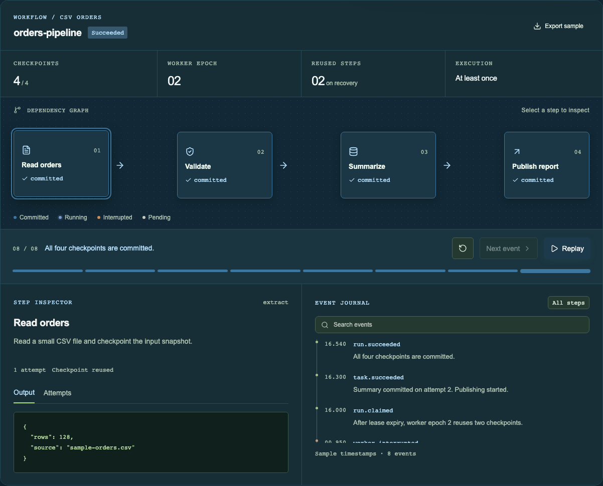
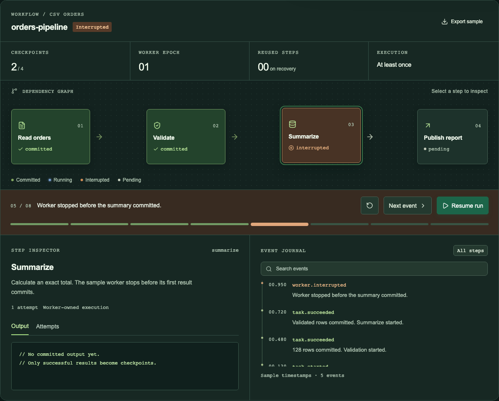
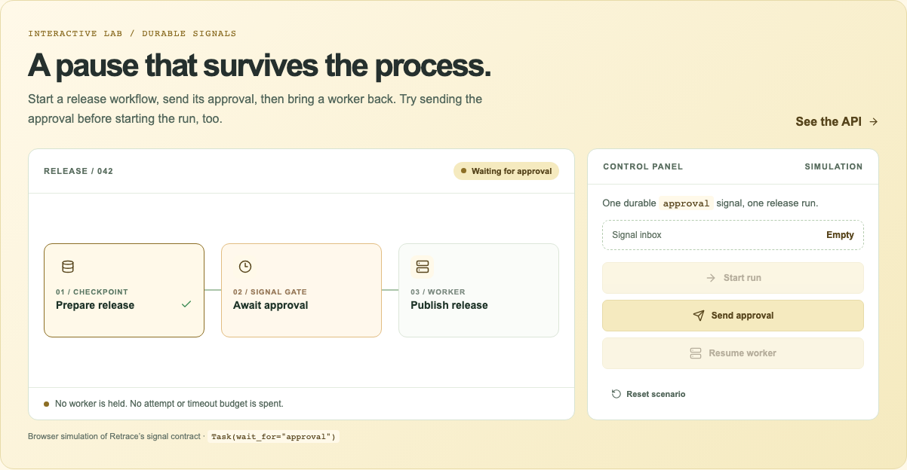
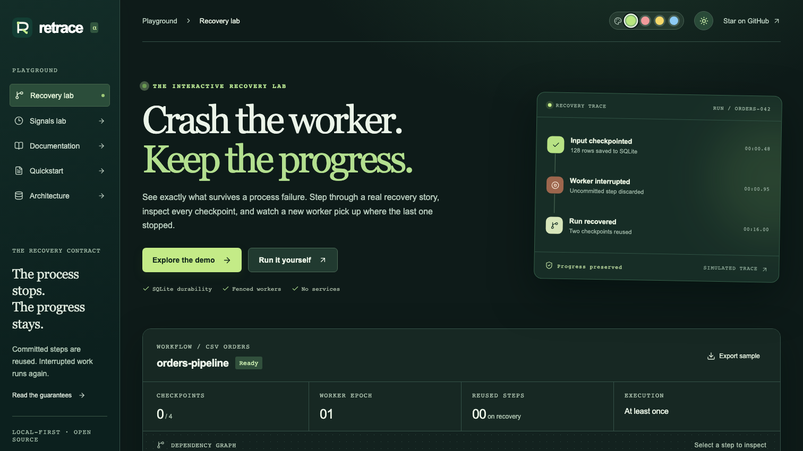
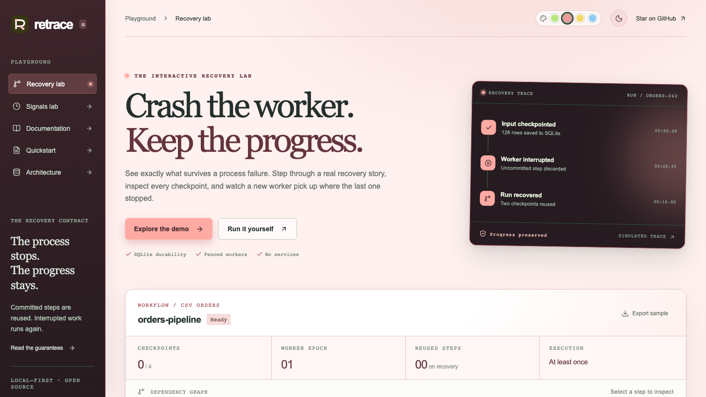
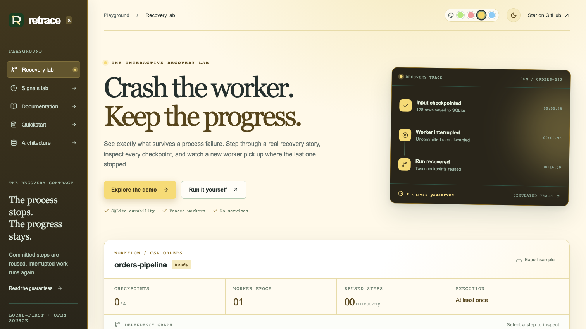
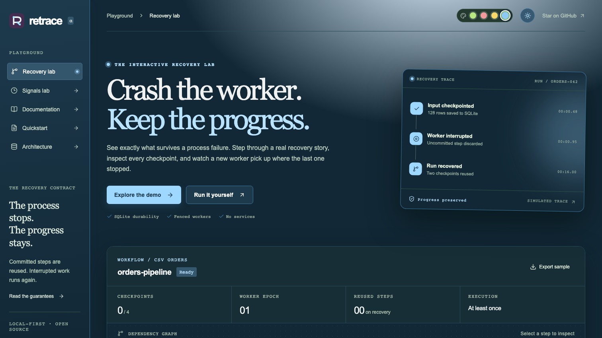

<p align="center"></p>
<h1 align="center">Retrace</h1>
<p align="center"><strong>The process can stop. The progress stays.</strong><br>Crash-resumable Python workflows. One local SQLite database.</p>
<p align="center">
  <a href="https://github.com/Sanjays2402/retrace/actions/workflows/ci.yml"></a>
  
  
  <a href="LICENSE"></a>
</p>

Retrace is an embedded workflow engine for async Python. It checkpoints successful steps,
retries transient failures, and resumes interrupted dependency graphs. Run local data pipelines,
document ingestion, batch API jobs, or approval workflows with durable progress and an inspectable
execution history.

The local inspector shows what completed, what failed, and what needs recovery. Workflow health
analytics help you measure reliability; configurable checks turn those measurements into JSON
results and exit codes for your own monitoring scripts.

**Early alpha:** the API may change before 1.0. Retrace supports a single-machine worker pool,
with zero Python runtime dependencies. It is MIT licensed and is not yet published to PyPI.

<p align="center">
  <a href="https://sanjays2402.github.io/retrace/">Try the interactive demo</a> ·
  <a href="https://sanjays2402.github.io/retrace/docs/">Read the documentation</a> ·
  <a href="https://sanjays2402.github.io/retrace/docs/choosing-retrace/">Is Retrace a fit?</a>
</p>

[](https://sanjays2402.github.io/retrace/)

**[Try the recovery playground →](https://sanjays2402.github.io/retrace/)** · [Install locally](#quickstart)

In the browser playground, interrupt a run and resume it to see checkpoint reuse. For real SQLite persistence and worker recovery, follow the local quickstart below.

## Why Retrace

- **Preserve completed work.** Resume after a worker crash without replaying successful steps.
- **Handle unreliable dependencies.** Persist retry deadlines, classify permanent errors, and
  retry selected failed branches while preserving checkpoints and history.
- **Keep local operations small.** Share one SQLite file across worker processes; use durable
  submission keys, fair scheduling, queue limits, cancellation, and graceful drain.
- **Diagnose and measure.** Inspect attempts and worker handoffs, export reports and traces,
  and compare failure rates, completion latency, recovered runs, and expired leases.

## Quickstart

Requires **Python 3.11+**. Install from source:

```bash
git clone https://github.com/Sanjays2402/retrace.git
cd retrace
python3 -m venv .venv
source .venv/bin/activate              # Windows: .venv\Scripts\activate
python -m pip install -e .
retrace demo
retrace serve
```

Open **http://127.0.0.1:7760**. In another activated terminal, run `retrace demo` again to watch
new runs appear. This eight-step document-indexing simulation deliberately fails its first
embedding attempt, then retries and commits 512 simulated vectors. It makes no external API calls;
its checkpoints and history are persisted to a real SQLite database.

### Try crash recovery

```bash
retrace --lease-ttl 1.5 demo --crash
# Exits with code 86 during embedding. Copy the printed run ID.
# Wait two seconds for the dead worker's lease to expire, then:
retrace resume retrace.demo:workflow <RUN_ID>
retrace inspect <RUN_ID>
```

Completed steps are reused. The interrupted attempt remains in the timeline, and a new worker
finishes the run. Follow the [five-minute recovery walkthrough](https://sanjays2402.github.io/retrace/docs/getting-started/)
for the complete sequence.

## Define a workflow in ordinary Python

Save this as `pipeline.py`:

```python
from retrace import Context, Task, Workflow


async def extract(ctx: Context):
    return ctx.input["values"]


async def summarize(ctx: Context):
    values = ctx.dependencies["extract"]
    return {"total": sum(values), "count": len(values)}


workflow = Workflow(
    "analytics",
    (
        Task("extract", extract),
        Task("summarize", summarize, needs=("extract",)),
    ),
    version="1",
)
```

```bash
retrace run pipeline:workflow --input '{"values": [3, 7, 11]}'
```

The final checkpoint contains `{"count": 3, "total": 21}`. You can also embed `Engine` and `Store`
in your application. See the [Python API guide](https://sanjays2402.github.io/retrace/docs/api/)
and [runnable CSV, HTTP, retry, and approval examples](https://sanjays2402.github.io/retrace/docs/examples/).

## Queue work across local processes

```bash
retrace --db jobs.db submit examples.pipeline:workflow \
  --input '{"values":[3,7,11]}' --key batch-42
retrace --db jobs.db queue --configure examples.pipeline:workflow \
  --max-active 2 --max-queued 100
retrace --db jobs.db worker examples.pipeline:workflow --max-runs 2
# Start another worker in a second terminal against the same local database.
```

Workers atomically claim eligible runs matching their workflow fingerprint. A crashed worker's
run becomes eligible after its lease expires; stale workers cannot commit checkpoints after
ownership changes. Submission keys deduplicate identical requests, including after completion.
Use `--delay 60` for durable delayed dispatch or `worker --once` to drain available work and exit.

Workers can load multiple definitions. A durable round-robin cursor alternates between eligible
definitions, and persisted queue limits apply across local producers and workers. SIGTERM stops
new claims, drains active work for a configurable grace period, and pauses unfinished work for
handoff. The inspector’s **Queue overview** shows backlog, capacity limits, signal waits,
and expired leases ready for recovery across all definitions. See [worker and queue semantics](https://sanjays2402.github.io/retrace/docs/api/#local-worker-pool).

## Measure reliability and check operational thresholds

The **Workflow health** panel compares definitions over 24 hours, 7 days, or 30 days. It reports:

- Failed runs as a fraction of succeeded plus failed runs.
- p50/p95 completion elapsed time, including queueing, signal waits, and recovery.
- Failed and interrupted attempts, succeeded runs that recovered after failure, and expired leases.

```bash
retrace --db jobs.db health --hours 168 > weekly-health.json
retrace --db jobs.db health --hours 168 \
  --max-failure-rate 0.05 --max-p95-seconds 60 \
  --max-expired-leases 0 --min-completed 20 > health-check.json
```

Thresholds apply per workflow definition. Checks return `0` for pass, `1` for a known breach,
`2` for invalid options or an infrastructure error, and `3` for insufficient data without a known
breach. Rate and latency checks require enough completed runs; empty or truncated cohorts cannot
silently pass. A fresh demo database may legitimately return `3`.

These are creation-time cohorts, using current run states and retained history. The latest 10,000
matching runs are sampled, with truncation recorded explicitly. They are operational measurements,
not an SLA guarantee. Read the [metric definitions](https://sanjays2402.github.io/retrace/docs/api/#measure-workflow-health)
and [threshold guide](https://sanjays2402.github.io/retrace/docs/api/#check-operational-thresholds).

## Monitor queues with Prometheus

Scrape `http://127.0.0.1:7760/metrics` while the local inspector is running, or export a snapshot:

```bash
retrace --db jobs.db metrics > queue.prom
```

Graph queue states, configured capacity, and oldest eligible waits per definition. These read-only
gauges omit application payloads and run IDs. See the [scrape configuration and alert examples](https://sanjays2402.github.io/retrace/docs/api/#prometheus-monitoring).

## Investigate a run

The read-only local inspector combines a dependency graph, attempt timeline, worker epochs,
checkpoint outputs, and a searchable event journal. Expand the live list up to 1,000 runs,
filter for work needing attention, or save a permalink to a selected run and step.

```bash
retrace --db jobs.db runs --status failed --status waiting
retrace --db jobs.db runs --workflow analytics --limit 25
retrace --db jobs.db runs --before <LAST_RUN_ID>
retrace --db jobs.db report <RUN_ID> > run.report.json
retrace --db jobs.db trace <RUN_ID> > run.trace.json
retrace --db jobs.db events <RUN_ID> > events.jsonl
```

**Download report** captures checkpoint metadata, complete attempt history, signal names, and
recent events in one coherent snapshot. Inputs, outputs, signal/event payloads, and exception
messages are omitted by default. Names and identifiers remain visible; review them before sharing.
Payloads require an explicit `report --include-payloads` opt-in in the CLI.

**Download trace** exports recorded attempts for [Perfetto](https://ui.perfetto.dev), with one lane
per task. The journal supports combined filters, payload search, and filtered JSONL downloads.
See [diagnostic reports](https://sanjays2402.github.io/retrace/docs/api/#export-a-diagnostic-report).

## Recovery and maintenance

| Operation | Command or API | Behavior |
| --- | --- | --- |
| Wait for a decision | `Task(..., wait_for="decision")` and `retrace signal RUN_ID decision --payload '{"approved":true}'` | Durable one-shot signal; waiting releases the worker lease |
| Preview a failed-branch retry | `retrace retry pipeline:workflow RUN_ID --task summarize --dry-run` | Shows affected steps without resetting checkpoints |
| Retry a failed branch | `retrace retry pipeline:workflow RUN_ID --task summarize` | Preserves successful steps and attempt history |
| Cancel work | `retrace cancel RUN_ID` | Durable cancellation revokes ownership; completed checkpoints remain |
| Back up live data | `retrace backup backups/snapshot.db` | Checked standalone snapshot including committed WAL data; never overwrites a destination |
| Preview cleanup | `retrace prune --older-than 30` | Protects unfinished work and submission keys; deletion requires `--apply` |

Commands in the table use `retrace.db` by default; put `--db jobs.db` **before** the subcommand
to select another database. Create the backup directory first. `resume` continues interrupted work;
`retry` explicitly resets failed steps after the external cause has been fixed.

Read [durable signals](https://sanjays2402.github.io/retrace/docs/api/#durable-signals),
[recovery](https://sanjays2402.github.io/retrace/docs/recovery/),
[backup and restore](https://sanjays2402.github.io/retrace/docs/api/#back-up-and-restore-a-database),
and [retention](https://sanjays2402.github.io/retrace/docs/api/#retain-useful-runs-and-clean-up-old-history)
for the detailed contracts.

## Guarantees and boundaries

- **Task execution is at least once.** A crash can happen after an external request succeeds
  and before its checkpoint commits. Use `ctx.idempotency_key` with downstream systems that
  support deduplication. Fencing protects Retrace's database, not external side effects.
- **Single machine, local disk.** Multiple local processes can claim separate runs from one
  database. Multi-host scheduling, network filesystems, and multi-tenant hosting are outside
  the supported scope.
- **Completed outputs are immutable checkpoints.** Successful functions are not replayed
  during resume. Workflow fingerprints prevent changed definitions from reusing checkpoints.
  Bump `Workflow.version` when implementation behavior changes: fingerprints do not hash function
  source or installed dependencies.
- **Tasks must cooperate with asyncio.** Blocking work delays heartbeats. Timeouts and
  cancellation cannot forcibly terminate code that suppresses cancellation.
- **Small JSON payloads.** Inputs and outputs are limited to 1 MiB each; keep large artifacts
  outside the database. Writable opens migrate supported older database schemas; back up first.
- **Local inspection.** The inspector binds to loopback and rejects foreign Host/Origin headers.
  It has no mutation routes and displays stored application data. Avoid persisting secrets.

See [architecture and failure semantics](https://sanjays2402.github.io/retrace/docs/architecture/)
and [security guidance](https://sanjays2402.github.io/retrace/docs/security/).

## Explore the browser demo

The [public recovery playground](https://sanjays2402.github.io/retrace/) needs no account or install.
It demonstrates checkpoint reuse, worker crashes, signal gates, journal search, and theme switching.
It uses **synthetic browser data**; the Python engine and local inspector persist actual runs to SQLite.

| Worker interrupted · green | Run recovered · blue |
| :---: | :---: |
| [](docs/assets/feature-interrupted.png) | [](docs/assets/feature-recovered.png) |

<details>
<summary>More screenshots: signal gates and four color themes</summary>

[](docs/assets/feature-signal-wait.png)

| Green · dark | Red · light |
| :---: | :---: |
| [](docs/assets/theme-green.png) | [](docs/assets/theme-red.png) |
| Yellow · light | Blue · dark |
| [](docs/assets/theme-yellow.png) | [](docs/assets/theme-blue.png) |

</details>

[Playground source and development guide](playground).

## Development and validation

```bash
python -m pip install -e '.[dev]'
ruff check .
ruff format --check .
python -m coverage run -m unittest discover -s tests -v
python -m coverage report --fail-under=95
python -m build
python scripts/smoke_wheel.py
```

For the inspector browser suite:

```bash
npm ci --ignore-scripts
npx playwright install chromium
npm run check:ui
npm run test:ui
```

The current suite has **147 Python tests and 25 browser tests**, with **96% Python coverage**.
CI enforces a 95% coverage floor and tests Python 3.11–3.14 on Linux, plus Python 3.12 on macOS
and Windows. Tests cover process crashes, producer/worker contention, generated DAGs, stale-worker
fencing, rollback, persistent retry deadlines, retention, exports, health checks, and browser
interactions. Packaging CI installs the wheel in a clean environment outside the source tree.

The [reproducible benchmark](https://sanjays2402.github.io/retrace/docs/benchmark/)
records scheduler and checkpoint overhead, including the limits of its measurements.

## Contribute

Read [CONTRIBUTING.md](CONTRIBUTING.md) and the
[roadmap](https://sanjays2402.github.io/retrace/docs/roadmap/). Contributions that improve verified
recovery semantics, operational visibility, or a concrete workflow limitation are welcome.
Include a minimal workflow and a diagnostic report with sensitive identifiers reviewed when
reporting a bug. Full payload reports should not be shared without reviewing their contents.

MIT licensed. Built by [Sanjay Santhanam](https://github.com/Sanjays2402).
