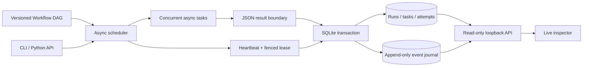
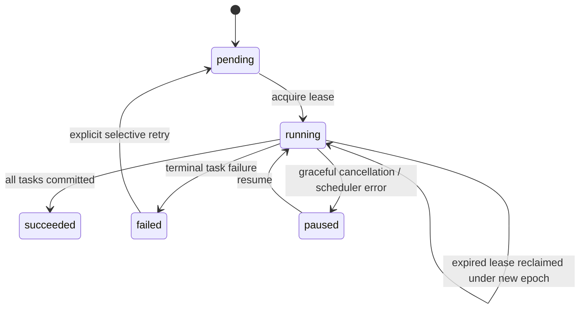
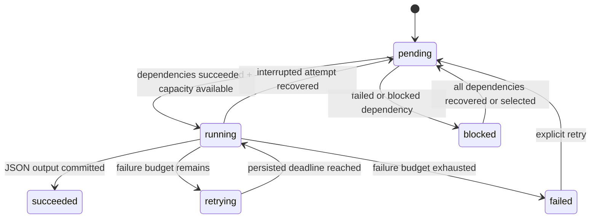

# Architecture and failure semantics

Retrace is an embedded, single-machine orchestrator. It keeps scheduling, durable storage,
and observation separate so execution semantics can be tested without a browser or service.

## Ownership protocol

1. `Store.claim` enters `BEGIN IMMEDIATE`, checks the workflow fingerprint, and rejects a live owner.
2. It increments the run's epoch, assigns a random owner token, and sets an absolute lease deadline.
3. Running attempts left by an expired owner become `interrupted`; their tasks return to `pending`.
4. A heartbeat renews the lease every third of its configured TTL.
5. Before **every** task-state write, heartbeat, or release, the transaction checks owner, epoch,
   and expiry. An old worker cannot commit after a takeover, even if it eventually returns a result.
6. Loss of ownership aborts the scheduler and cancels its active coroutines. Recovery requires
   a subsequent explicit `resume` call; there is no background dispatcher.

SQLite serializes writers; the lease covers a whole run. Several tasks of that run execute
concurrently in its owning event loop. Separate processes may own separate runs. Short,
synchronous SQLite transactions execute on the event-loop thread. A contended or slow disk can
delay the heartbeat: increase the TTL for your workload and keep the database on local storage.
The default TTL is 15 seconds. Lease comparisons use wall-clock time on one machine; clock jumps
can change when ownership expires. An epoch still fences writes after a takeover.

## State machines

Independent branches finish after a task fails; descendants are marked blocked without
execution. A run becomes failed when no executable work remains. `resume` returns existing
results for failed and succeeded runs without retrying functions. Explicit `retry` can reopen a
failed run. It validates the same workflow fingerprint, checks ownership, and atomically resets
selected failed steps and blocked descendants whose dependencies can all make progress. Successful
checkpoints stay unchanged. A branch left failed keeps its shared descendants blocked.

Retry resets each affected task's current failure budget to zero, while preserving attempt numbers,
attempt records, idempotency keys, and all existing events. Each `task.reset` event records the
previous status and budget count, followed by `run.retry_requested`. The run becomes pending and
is then claimed normally with a new epoch. If the process exits between reset and execution,
`resume` continues the pending run. Competing reset requests serialize in `BEGIN IMMEDIATE`;
a second request sees the pending/running state and cannot reset the same failure again.

`Store.retry_plan` uses a read-only transaction for a consistent preview. It is a snapshot, not a
reservation: applying retry revalidates the current state inside the write transaction. No schema
change is needed; version-1 databases remain compatible. See [the recovery guide](recovery.md).

`RetryPolicy.max_attempts` is the budget for **failed** attempts. A task with `max_attempts=3`
may fail twice and succeed on its third attempt. Interrupted attempts are separately recorded
and do not consume the failure budget; repeated crashes may therefore create more than three
attempt records. Manual retry opens a fresh failure budget, so lifetime failures can also exceed
`max_attempts`; the attempt journal retains that history. Backoff is deterministic, capped, and persisted as an absolute retry deadline.
Jitter and exception-specific retry filters are future work.

## Commit boundary and side effects

The result, task state, attempt state, and corresponding event commit in one transaction.
If any write fails, all of those changes roll back. A completed checkpoint is therefore either
fully visible or absent. `PRAGMA synchronous=FULL` and WAL are enabled. These settings still
depend on the filesystem and hardware honoring durability operations.

| Failure point | Recovery behavior |
| --- | --- |
| Before a task starts | Task remains pending |
| During the coroutine | Expired owner is replaced; interrupted attempt is recorded and rerun |
| After an external side effect, before checkpoint | Task may execute the side effect again |
| During the checkpoint transaction | Transaction rolls back; uncommitted work is rerun |
| After successful checkpoint | Output is reused; function is not called again |
| Old worker returns after takeover | Fenced write raises `LeaseLost`; result is rejected |
| Exception or cooperative timeout | Failure count increments; retry or terminal failure is persisted |
| SIGINT / coroutine cancellation | Running attempts become interrupted; run is paused |

Use `Context.idempotency_key` for side-effect deduplication. The key is stable for one `(run_id,
task_name)` across attempts, but different runs intentionally get different keys. A payment,
message, file write, or remote mutation needs its own idempotency contract. Retrace does not
provide exactly-once external effects.

## Definition and data contract

Definitions are frozen dataclasses. DAG validation checks unique names, missing dependencies,
and cycles. A canonical manifest fingerprints workflow name/version, task names, dependencies,
qualified function identity, timeout, and retry settings. It does **not** hash function bytecode,
closures, environment variables, files, package versions, or remote APIs. Bump the workflow version
when any such change makes prior checkpoints incompatible. Retain the original code to resume
older runs; version mismatch is deliberately not overrideable.

Inputs and outputs cross a JSON boundary, with a 1 MiB encoded limit and non-finite numbers
rejected. Each task receives independently decoded input and dependency data. Local mutations
cannot change another task's checkpoint. Python-specific objects, generators, and pickle are
not supported. Tuples normalize to arrays; dictionary keys must be appropriate for JSON.
Store blobs externally and return references/checksums.

## Observation and security

The inspector opens a read-only SQLite connection per HTTP request and reads each multi-table
snapshot inside a single transaction. The server never imports workflow modules. Browser polling
fetches the latest 100 runs and ordered journal pages, with an exclusive event cursor. The browser
retains the latest 1,000 received events; `retrace events` exports the complete journal.

The UI treats stored values as data and escapes markup. Task outputs use `textContent`. The server
binds only to `127.0.0.1`, validates Host and Origin, sends a restrictive Content Security Policy,
and exposes no mutation endpoints. It has no authentication and is not an internet-facing server.

## Storage and scale

`runs` stores definition, input, lease, and overall state; `tasks` stores the latest checkpoint;
`attempts` preserves execution history; `events` is the ordered audit log. Foreign keys are enabled.
`PRAGMA user_version=1` marks the schema; unknown future versions are refused. There is no migration
framework yet, so back up databases before upgrading alpha versions.

The scheduler scans persisted task state and currently loads task snapshots when starting work.
It favors transparency over high-throughput scheduling and is intended for modest DAGs with
meaningful I/O per step. It is not optimized for millions of tiny tasks. SQLite permits only one
writer at a time. Journals grow without automatic retention. Use the reproducible benchmark script
to measure your own disk/workload rather than assuming a throughput guarantee.

## Verification map

- `tests/test_core.py`: state propagation, concurrency bound, retries, version checks, timeout,
  JSON contract, isolated inputs, atomic rollback, and stale-worker fencing.
- `tests/test_recovery.py`: actual process kill and new-process recovery, database integrity,
  heartbeat loss, retry deadline persistence, and generated DAG reference comparisons.
- `tests/test_cli.py`: command exit codes, JSON output, event export, demo, and invalid inputs.
- `tests/test_server.py`: coherent snapshots, event cursors, read-only routes, Host/Origin checks,
  static assets, and traversal rejection.
- `scripts/smoke_wheel.py`: install the wheel in a new virtual environment and run from outside
  the repository, verifying the packaged inspector assets.

Implementation references: [Python sqlite3 transaction control](https://docs.python.org/3/library/sqlite3.html#transaction-control),
[asyncio task cancellation](https://docs.python.org/3/library/asyncio-task.html#task-cancellation),
and [SQLite WAL](https://sqlite.org/wal.html).
