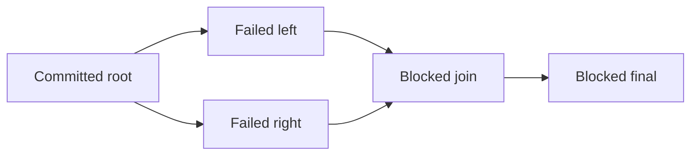

# Recovering a failed run

`resume` recovers interrupted execution. `retry` explicitly reopens failed steps after the
underlying cause is fixed. Both reuse committed successful outputs, but only retry resets the
failure budget. Retrying does not allow a different workflow definition or changed input.

## A complete local example

The included `examples.recoverable` workflow extracts 128 records, then simulates an unavailable
service. A local readiness file acts as the switch; no real external service is contacted.

```bash
retrace run examples.recoverable:workflow --input '{"ready_file":"service.ready"}'
# Save the printed RUN_ID. The run fails after two publish attempts.
python -c "from pathlib import Path; Path('service.ready').touch()"
retrace retry examples.recoverable:workflow <RUN_ID> --dry-run
retrace retry examples.recoverable:workflow <RUN_ID>
retrace inspect <RUN_ID>
```

The plan lists `publish` under `reset` and `extract` under `preserved`. After recovery, extraction
still has one attempt. Publishing has three attempts: the two original failures and the final
success. Its idempotency key is unchanged. Existing errors remain in the attempt journal even
though the latest checkpoint has succeeded.

## Branch selection

Repeat `--task` to choose multiple currently failed steps; omit it to retry all failures.
Consider a graph where `left` and `right` both failed and a `join` depends on both:



Retrying only `left` reopens `left`. `join` and `final` remain blocked by `right`. The run still
reports failure, but preserves the newly successful `left` checkpoint. A later retry of `right`
can reopen `right`, `join`, and `final` without repeating `root` or `left`. Unknown, duplicate,
empty, successful, and blocked selections are rejected. Select the failed cause, not its blocked
symptom.

## Audit and budgets

- Same run ID and workflow fingerprint; no source-code or input override.
- Successful task rows and outputs remain unchanged.
- Reset task rows clear latest error/output/timing/deadline and receive `failures=0`.
- Attempt numbers are monotonically increasing. Old attempts and events are never deleted.
- Each `task.reset` records previous status and budget count; `run.retry_requested` records the plan.
- `RetryPolicy.max_attempts` applies to the new failure budget. Repeated manual retries may
  accumulate more lifetime failures than that limit. Interrupted attempts do not consume it.
- All resets and their journal events commit atomically. A crash before commit leaves the old
  failed run; a crash after commit leaves a pending run that can be resumed.
- A read-only plan is only a preview. Retry rechecks the current state, so concurrent commands
  cannot apply the same failure reset twice. Another worker may claim the pending run; ownership
  is still enforced by the normal lease protocol.

Repair an external dependency and keep the original workflow implementation to reuse its
checkpoints. If the function behavior, input, or dependency contract must change, create a new
run with a new version instead.

## External side effects

A failed attempt may already have performed an external mutation. Retry keeps the stable
`Context.idempotency_key`; use it with a downstream service that actually deduplicates requests.
Database fencing and preserved checkpoints do not provide exactly-once external effects.
